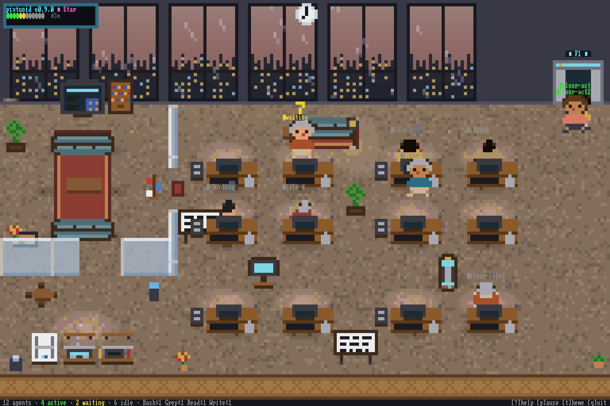
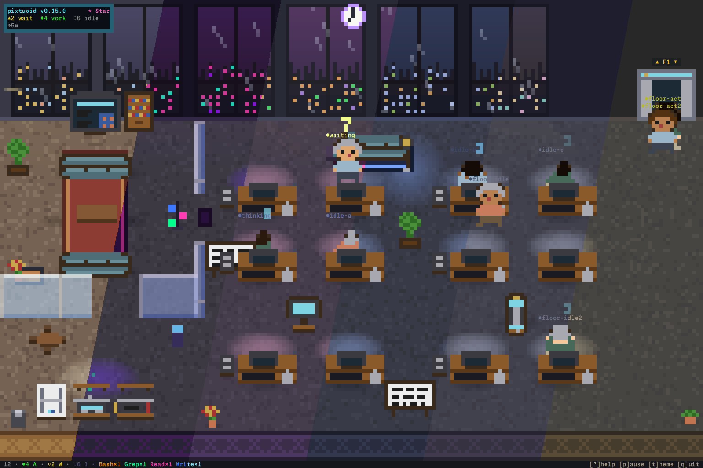

<p align="center">
  
</p>

<h1 align="center">pixtuoid</h1>

<p align="center">
  <em>Your AI coding agents, visualized as pixel-art coworkers in a terminal office.</em>
</p>

<p align="center">
  <sub><em><b>pix</b>el + <b>tu</b>i + (agent-)<b>oid</b></em></sub>
</p>

<p align="center">
  <a href="https://github.com/IvanWng97/pixtuoid/stargazers"></a>
  <a href="https://github.com/IvanWng97/pixtuoid/releases"></a>
  <a href="LICENSE"></a>
  <a href="https://github.com/IvanWng97/pixtuoid/actions/workflows/ci.yml"></a>
  <a href="https://codecov.io/gh/IvanWng97/pixtuoid"></a>
  <a href="https://claude.ai/code"></a>
  <a href="https://buymeacoffee.com/IvanWng97"></a>
</p>

<p align="center">
  
</p>

<p align="center">
  <a href="https://ivanwng97.github.io/pixtuoid/"><strong>🖥&#xFE0E; Live demo ↗</strong></a>
  &nbsp;·&nbsp; <a href="https://ivanwng97.github.io/pixtuoid/architecture">Architecture</a>
  &nbsp;·&nbsp; <a href="https://ivanwng97.github.io/pixtuoid/config">Configuration</a>
  &nbsp;·&nbsp; <a href="https://ivanwng97.github.io/pixtuoid/contributing">Contributing</a>
</p>

---

## Why?

Running several coding agents means alt-tabbing between terminals to find out who's stuck, who's waiting on a permission prompt, and who finished ten minutes ago. **pixtuoid** puts them all in one tiny pixel-art office you can watch from above — every session is a character at a desk: typing while it works, raising a `?` when it needs you, dozing off when it's done.

A little bit *Black Mirror*, a little bit *The Sims* — and the most glanceable multi-agent dashboard you'll ever use.

## Quick Start

Pick one — Homebrew on macOS, or npm on any OS:

<!-- install:start · generated from site/src/install.json by `just gen-readme` — edit the JSON, not this block -->
**Homebrew** (macOS):

```bash
brew install IvanWng97/pixtuoid/pixtuoid
```

**npm** (any OS):

```bash
npm install -g pixtuoid
```
<!-- install:end -->

Then launch:

```bash
pixtuoid
```

Press `s` to open the **Sources** panel and connect your agent CLI (Claude Code, Codex, Antigravity, Reasonix, …) — pixtuoid wires up the integration for you, no separate install step. In another terminal, start that coding agent. A character walks in from the elevator within a second; disconnect in the same panel and it walks back out. The panel also flags a source whose hooks are connected but broken (run `pixtuoid doctor` for the full health report).

**Keyboard shortcuts:** `q` quit · `p` pause · `s` sources (connect / health) · `t` themes · `Tab` agent dashboard · `?` help · `↑↓/jk/PgUp/PgDn` floors · click to pin tooltip

**More ways to install** — Cargo, prebuilt binaries, and Debian `.deb`s — are on the **[install guide ↗](https://ivanwng97.github.io/pixtuoid/#install)**. Upgrading from `ascii-agents`? See [docs/MIGRATION.md](docs/MIGRATION.md).

## Features

<!-- features:start · generated from site/src/features.json by `just gen-readme` — edit the JSON, not this table -->
| | Feature | Description |
|---|---|---|
| 🏢 | **Multi-agent office** | Each agent session gets a desk; overflow agents auto-fill new floors |
| 🛗 | **Multi-floor office** | PageUp/PageDown/↑↓/jk to navigate floors with slide transition |
| 🪟 | **Floating desktop window** | `pixtuoid floating` opens a frameless, always-on-top desktop window of the office — not just a terminal TUI |
| 🎭 | **Animated characters** | Typing, waiting (`?`), sleeping (z's), walking with A\*-routed pathfinding |
| 💡 | **Per-tool monitor glow** | Edit = blue, Bash = orange, Read = cyan — scannable at a glance |
| 🎨 | **Per-agent identity** | Deterministic shirt/hair/skin palette from session hash, 16 curated outfits |
| 🦞 | **OpenClaw gateway mascot** | A live OpenClaw gateway shows up as a wandering lobster whose motion tracks gateway health |
| 🌧️ | **Weather effects** | Rain, storm, snow, fog, overcast, windy — cycles every 10 min + sunset golden hour |
| 🔎 | **Hover tooltips** | Hover an agent for session duration, tool-call count and active-time %; hover any furniture — desks, sofas, plants, vending machine, printer — for its name |
| 🐾 | **Office pets** | A cat or dog (one per floor) roams desks, pantry, sofas; sleeps near idle agents. Click to pet — pixel-art hearts float up |
| 🛡️ | **Hook-safe** | The shim always exits 0 — a stuck visualizer can never block your agent |
<!-- features:end -->

<p align="center">
  <a href="https://ivanwng97.github.io/pixtuoid/#showcase"><strong>▶ See every feature live — floors, themes, weather, pets, the office tour →</strong></a>
</p>

## Supported Tools

<!-- tools:start · generated from site/src/sources.json by `just gen-readme` — edit the JSON, not this table -->
| Tool | Runs on |
|---|---|
| [Claude Code](https://code.claude.com) | macOS · Linux · Windows\* |
| [Codex CLI](https://github.com/openai/codex) | macOS · Linux · Windows\* |

_Also supported: [Antigravity CLI](https://github.com/antiGravity-AI/antigravity-cli), [DeepSeek-Reasonix](https://github.com/esengine/DeepSeek-Reasonix), [CodeWhale](https://github.com/Hmbown/CodeWhale), [Copilot CLI](https://github.com/github/copilot-cli), [opencode](https://github.com/anomalyco/opencode), [Cursor CLI](https://cursor.com/cli), [OpenClaw](https://github.com/openclaw/openclaw)._

**→ [Full tool × OS support matrix on the site](https://ivanwng97.github.io/pixtuoid/#tools)**

_\* experimental — limited testing, unsigned binaries._
<!-- tools:end -->

> Adding a new tool? Implement the [`Source` trait](#contributing) — or, for a hook-only CLI, just a hook decoder + an install `Target` — then add a row to [`site/src/sources.json`](site/src/sources.json) (its `supported` set is pinned to the code by a test). One file, one channel, done.

## Themes & Configuration

Press `t` to cycle the built-in themes with live preview. Your choice persists across sessions:

<p align="center">
  
</p>

Settings live in `~/.config/pixtuoid/config.toml` — theme, desk cap, custom pet
names, and sprite packs. CLI flags override the file (`pixtuoid run --theme dracula`).
See **[docs/CONFIGURATION.md](docs/CONFIGURATION.md)** for the full key reference
(defaults, system-managed keys), the custom sprite-pack workflow, and **logging /
troubleshooting** (the TUI writes warnings to `~/.cache/pixtuoid/log`) — or browse it
live at **[/config](https://ivanwng97.github.io/pixtuoid/config)**.

## How It Works

Agent CLIs emit events two ways — a hook shim (a 200ms fire-and-forget write to a Unix socket, or a named pipe on Windows, that can never block your agent) and JSONL transcript watching. Both feed one channel; a reducer folds events into office state; the renderer draws it as half-block pixel art. Four Rust crates, zero terminal deps in the core.

**[Full architecture with diagrams →](https://ivanwng97.github.io/pixtuoid/architecture)** · single source: [`docs/ARCHITECTURE.md`](docs/ARCHITECTURE.md)

## Privacy & Security

pixtuoid is **local-only and telemetry-free** — it makes no network connections,
ships no analytics or "phone home", and reads your agent transcripts read-only to
animate the office. Your session data never leaves your machine. The dependency
set is audited for advisories daily (`cargo-deny`). For the trust boundaries (the
hook shim, the owner-only socket, and how hook installation edits another tool's
config), see **[SECURITY.md](SECURITY.md)**.

## Contributing

PRs welcome — especially new themes, sprite/decoration polish, and `Source` adapters for agent CLIs we don't support yet (the nine already wired up are in [Supported Tools](#supported-tools)). See **[CONTRIBUTING.md](docs/CONTRIBUTING.md)** for the build/test workflow, conventions, the review process, and how to add a new agent CLI. Architecture and the load-bearing invariants live in [`CLAUDE.md`](CLAUDE.md).

## Acknowledgments

Inspired by [`pixel-agents`](https://github.com/pablodelucca/pixel-agents) (VS Code), [`clawd-on-desk`](https://github.com/rullerzhou-afk/clawd-on-desk) (desktop pet), and Claude Code's [Buddy](https://dev.to/picklepixel/how-i-reverse-engineered-claude-codes-hidden-pet-system-8l7).

## License

[MIT](LICENSE)

## Star History

<p align="center">
  <a href="https://www.star-history.com/?repos=IvanWng97%2Fpixtuoid&type=date&legend=top-left">
    <picture>
      <source media="(prefers-color-scheme: dark)" srcset="https://api.star-history.com/svg?repos=IvanWng97/pixtuoid&type=Date&theme=dark" />
      <source media="(prefers-color-scheme: light)" srcset="https://api.star-history.com/svg?repos=IvanWng97/pixtuoid&type=Date" />
      
    </picture>
  </a>
</p>

<p align="center">
  <sub>Enjoying the little office? <a href="https://buymeacoffee.com/IvanWng97">☕ Buy me a coffee</a> · <a href="https://github.com/IvanWng97/pixtuoid">⭐ Star the repo</a></sub>
</p>
