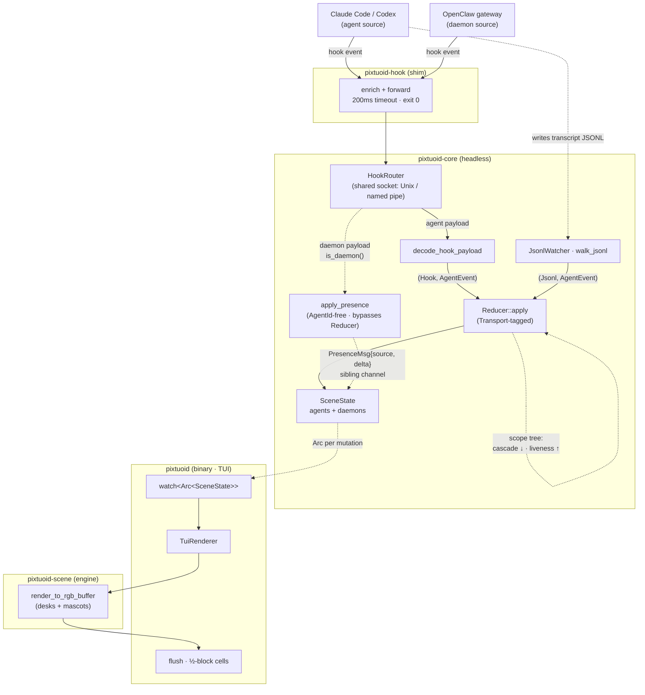

# Architecture

How a running coding-agent session becomes a moving sprite in the office.

> This file is the **single source** for Pocket Office's architecture overview.
> It renders in the retained local site and on GitHub (the diagram below is
> native Mermaid). `CLAUDE.md` (the agent
> guide) links here; per-crate "sharp edges" live in the nested `CLAUDE.md` files.

## The shape of it

pixtuoid is a Cargo workspace of **five crates** wired as a strict
**producer → reducer → renderer** pipeline:

- **`pixtuoid-core`** — the headless library. It has **no terminal dependencies**
  (no `ratatui`, no `crossterm`); terminal-specific code lives downstream in the
  binary's thin painters, which render through the engine's seam
  (`pixtuoid_scene::floor::render_floor` / `pixel_painter::render_to_rgb_buffer`).
  Owns sources, the reducer + scene state, the sprite format,
  and the grid/walkable vocabulary (the sim geometry — layout/physics/pose —
  lives in `pixtuoid-scene`; only the coherence-bound `walkable.rs` stays).
- **`pixtuoid-scene`** — the backend-agnostic render + simulation **engine**: the
  office world itself (`render_to_rgb_buffer`, layout geometry, walk physics,
  pose/motion/pathfinding, the theme model, pets, chitchat, the embedded default
  pack). It is
  terminal- AND window-free **by crate boundary** (no `ratatui`/`crossterm`/
  `winit`/`softbuffer` in its `Cargo.toml` — compiler-enforced, not just a lint).
  Depends on `pixtuoid-core`.
- **`pixtuoid`** — the binary: `clap` CLI, `tokio` runtime wiring, and two of the
  three thin painters over the engine — the TUI renderer (`ratatui` + `crossterm`)
  and the `floating` desktop window (`winit` + `softbuffer`). Depends on
  `pixtuoid-scene`.
- **`pixtuoid-web`** — the third painter: a publish-excluded `wasm-bindgen` crate
  that renders the same engine into a browser `<canvas>` (the site's live-office
  hero). Depends on `pixtuoid-scene` with default features off — core's `native`
  feature (the async source runtime: `tokio`/`notify`, the watchers and probes)
  is disabled, leaving the pure decode/reducer core that compiles to
  `wasm32-unknown-unknown`. A scripted event loop drives the real reducer; the
  built artifact is committed under `site/public/wasm/` (`just gen-wasm`).
- **`pixtuoid-hook`** — a tiny shim Claude Code invokes per hook event. It depends
  on no other crate; it reads stdin JSON, forwards it over a local IPC
  endpoint — a Unix socket on macOS/Linux, a named pipe on Windows (selected in
  `pixtuoid-hook/src/transport.rs`) — and **always exits 0** so it can never
  block your agent.

Dependency direction is one-way: `pixtuoid-core ← pixtuoid-scene ← {pixtuoid, pixtuoid-web}`. The
engine's render seam (`render_floor` / `render_to_rgb_buffer` in `pixtuoid-scene`)
is the inversion point that keeps the core terminal-free — the same pixel pass
drives the terminal, the desktop window, and a browser `<canvas>`. (A legacy
`#[doc(hidden)]` `Renderer` trait once lived in `pixtuoid-core`'s `render/`, but it
was NOT the seam and was retired in #483 — its two impls are now inherent methods.)

A **`Source`** is one of two classes (`source/registry.rs`'s `SourceKind`):

- an **Agent** — a transcript- or hook-bearing coding CLI (Claude Code, Codex,
  Cursor, …) that produces `AgentEvent`s → `SceneState::agents` → a **desk
  sprite**; or
- a **Daemon** — a long-running gateway with no transcript and no desk that
  produces `DaemonPresenceUpdate`s → `SceneState::daemons` → a single
  **presence-gated wandering mascot** whose _motion_ encodes the daemon's
  liveness.

The OpenClaw gateway is the first daemon — it ambles the office floor as a
lobster (idle), shuttles when a turn is in flight (busy), turns a sickly red
when its model backend is failing (degraded), and walks out when it goes down.
The two classes share the socket and the registry but never the reducer: the
daemon lane below is deliberately `AgentId`-free.

## Data flow

**Walking the pipeline (real symbols):**

1. **Ingest.** Claude Code fires a hook → the **`pixtuoid-hook`** shim
   (`enrich_payload` stamps `_pixtuoid_source`, a 200 ms write timeout, exit 0) →
   `HookSocketListener` on a Unix socket (a named pipe on Windows) →
   **`decode_hook_payload`** turns the JSON into one or more `AgentEvent`s —
   tool/permission payloads are preceded by an `Identity` event the reducer uses
   to register live-but-invisible sessions with real identity (mid-attach).
   In parallel, **`JsonlWatcher` → `walk_jsonl`** tails each
   agent's transcript file (with a first-sight gate so historical/ended sessions
   don't resurrect) and decodes lines via a per-source decoder (`decode_cc_line` /
   `decode_codex_line`).
2. **One channel.** Every source multiplexes onto a single
   `mpsc::Sender<(Transport, AgentEvent)>` (buffer 256). The `Transport`
   (`Hook` | `Jsonl`) tag is load-bearing: the reducer uses it for **hook-wins
   dedup** so a hook and its transcript echo don't double-count.
3. **Reduce.** `reducer_task` drains the channel into **`Reducer::apply`**, which
   updates a `SceneState`, runs garbage-collection/stale sweeps on a 1 Hz tick,
   and delegates single-slot transitions to the FSM. After every change it
   publishes a fresh `Arc<SceneState>` on a `watch` channel.
4. **Render.** `TuiRenderer` (in the binary) borrows the latest scene (O(1), no
   lock) and paints it through **`pixtuoid_scene::pixel_painter::render_to_rgb_buffer`**
   — a _terminal-agnostic_ pixel pass that lives in the engine crate — then
   `flush_buffer_to_term` compresses pairs of pixel rows into half-block (`▀`)
   terminal cells.

**The daemon lane (the OpenClaw gateway).** A daemon source creates no
`AgentSlot` and writes no transcript, so it skips the whole agent pipeline. The
**`HookRouter`** at the shared socket reads each payload's source: an agent's
goes to `decode_hook_payload`; a daemon's (`is_daemon()`) is decoded by the
source's own `presence_decoder` into `DaemonPresenceUpdate`s and pushed onto a
**sibling channel** as `PresenceMsg { source, delta }` (invariant #2 — NOT the
one `AgentEvent` channel). The reducer task merges those via **`apply_presence`**
— which is `AgentId`-free and never touches `Reducer::apply` — into
`SceneState::daemons`. The render pass then draws one mascot per live daemon,
its motion encoding the `DaemonState` (`Idle` / `Busy` / `Degraded` / `Down`).
A daemon has no per-session pid, so _silence_ is its abrupt-down signal (a TTL
sweep), while the gateway's own process pid is armed for instant `ExitWatch`.

## Seams & invariants

These are load-bearing — see `CLAUDE.md` and the nested guides before changing them.

- **The `Source` trait is the only seam for adding a transcript-bearing agent
  CLI** (Codex, Copilot CLI, Antigravity, …). Per-source format knowledge lives in that source's
  own decoder functions (injected into `JsonlWatcher` as fn pointers), not in a
  shared decoder. Hook-only CLIs (Reasonix, opencode, Cursor CLI,
  CodeWhale, Hermes — no watchable transcript) are the documented exception: no
  `Source` impl and no runtime wiring; their registry rows set
  `transcript: None` and supply a custom hook decoder, and each ships an
  install `Target` instead (bound via the in-TUI Sources panel).
- **A `Source` is an `Agent` or a `Daemon`** (`SourceKind`). A daemon (the
  OpenClaw gateway is the first) earns a presence-gated wandering mascot, not a
  desk: its deltas ride a **sibling channel** (`PresenceMsg { source, delta }`,
  invariant #2 — NOT the one `AgentEvent` channel) and merge via `apply_presence`,
  never `Reducer::apply` (which is `AgentId`-pure). The `HookRouter` demux and
  the daemon-sweep loop both dispatch on this enum, so a **second daemon is one
  registry `Daemon` row + one mascot arm + one badge arm** — no `handle_conn`
  edit and no new reducer arm.
- **Cross-source facts live in ONE registry row** (`source/registry.rs`,
  internal): each CLI's `SourceDescriptor` carries its label prefix, JSONL
  decoder, hook keying (`transcript_path` vs `session_id`, plus an optional
  source-specific hook decoder for events the shared arms can't express —
  Codex's subagent hooks, Reasonix's whole alien envelope), and capability
  flags. The reducer derives lifecycle policy from those flags — e.g. the
  short idle reaper is `!has_exit_signal && resurrects_on_prompt`, which today
  holds only for Codex (no exit signal of any kind, but a swept session walks
  back in on the next prompt) — instead of matching CLI names.
- **Events flow through ONE tagged channel.** Producers tag their own events; the
  reducer never hardcodes `Transport::Hook` — it reads the producer's tag.
- **`pixtuoid-core` has no terminal dependencies.** Anything terminal-specific
  lives in a thin painter over the engine's render seam (`render_floor` /
  `render_to_rgb_buffer`), never in the core or the scene engine.
- **The hook shim must never block the agent** — always exit 0, 200 ms write
  timeout.
- **Subagent supervision is a scope tree** (`state/scope.rs`): exit cascades
  _down_ (a parent's `SessionEnd` reaps its subtree), liveness flows _up_ (a
  working subagent keeps its ancestors fresh), and permission-blocked subagents
  are exempt from the stale sweep.
- **The walkable mask is the ground footprint only** — a top-down view, so a
  sprite can be visually taller/wider than the tile its base occupies.

## Where to go next

- **Configure it:** [`docs/CONFIGURATION.md`](CONFIGURATION.md)
- **Contribute:** [`CONTRIBUTING.md`](CONTRIBUTING.md)
- **Agent/contributor detail:** the workspace `CLAUDE.md` + the nested per-crate
  `CLAUDE.md` files.
